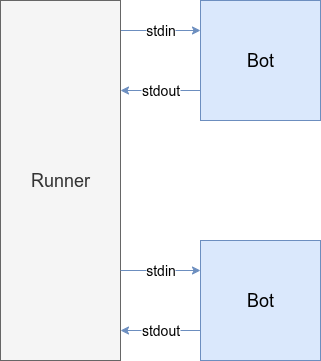
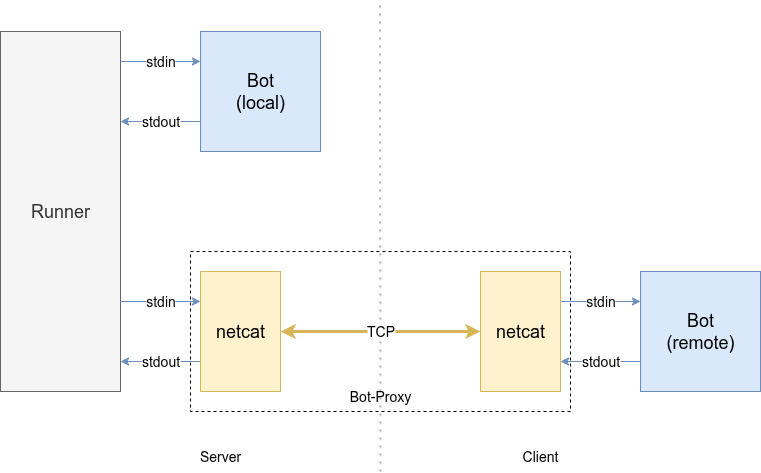

# Live-Sparring mit Bot-Proxy

Die Idee entstand durch eine Unterhaltung am [Discord-Server](https://hiddengems.gymnasiumsteglitz.de/news#inoffizieller-discord-server-fr-die-community).  Es gibt den [Feature-Request](https://github.com/specht/hidden-gems/issues/54) nach angemeldetem Sparring, wonach man einen Mitspieler herausfordern können soll, und bei dessen Annahme ein Duell über Nacht nach der regulären Auswertung oder in der Idle-Time gescheduled wird.
So eine Funktion ist natürlich aufwendig in der Implementierung; es solle aber eigentlich relativ einfach möglich sein, ein peer-to-peer Sparring umzusetzen, bei welchem die Bots jeweils auf dem eigenen Rechner ausgeführt werden.

In diesem Beitrag fangen wir mit der einfachsten Idee an und arbeiten uns im Laufe des Artikels zu einem umfangreicheren Framework vor.


## Recap: I/O Redirections

In einem vorigen [Blogbeitrag](https://hiddengems.gymnasiumsteglitz.de/blog/2026-02-17-botsteuerung-aus-dem-terminal) haben wir über Weiterleitungen der Ein- und Ausgaben gelesen.  Dadurch ist es beispielsweise möglich, die Standardausgabe an einen anderen Prozess zu schicken, und dessen Ausgabe wiederum als Standardeingabe zu lesen.  Man ist dabei nicht auf die Standardeingabe und -ausgabe beschränkt, sondern kann das im Prinzip mit (fast) allen Filedeskriptoren machen.  So funktioniert auch die Kommunikation vonseiten des Runners mit den Bots.




## Netcat

Wenn es nun irgendwie möglich wäre, die Ein- und Ausgaben zum und vom Runner nict nur an einen lokalen Bot umzuleiten, sondern über das Netzwerk zu schicken, könnte man Runner und Bot auf getrennten Rechnern ausführen...  Meet **netcat**! Es gilt als Schweizer Taschenmesser für Netzwerkverbindungen, und wird am häufigsten genau dazu eingesetzt, Weiterleitungen über das Netzwerk zu realisieren.


Die Idee ist dabei folgende. Ein Spieler übernimmt die Rolle des Servers: der Runner und der eigene Bot des Spielers werden auf dessen Rechner ausgeführt.
Mithilfe von jeweils einem netcat (`nc`) Prozess an den Enden der Verbindung wollen wir die Datenströme zwischen Runner und dem anderen Bot über das Netzwerk schicken, nämlich zum Rechner des anderen Spielers, der in der Client Rolle ist. Wir verwenden dazu TCP, ein verbindungsorientiertes Protokoll. Am Server startet `nc` im *listening* Modus, er wartet auf eingehende Verbindungen. Der Client initiiert den Verbindungsaufbau mittels *connect* zum Server.




Der Runner sieht hierbei keinen Unterschied, lediglich die Antworten lassen länger auf sich warten - wir merken uns, die Timeouts zu deaktivieren.  Auch der Bot sieht keinen Unterschied, er liest weiterhin das JSON von der Standardeingabe, führt seine Berechnungen durch und schreibt move & highlight auf die Standardausgabe. Und die Debugausgaben auf der Standardfehlerausgabe? Die bleiben lokal. Entweder lesen wir mit wenn sie auf dem Terminal ausgegeben werden, oder wir leiten sie alternativ auf `/dev/null` um.

Wie sieht das in Code aus? Für den Server müssen wir einen Bot-Proxy bereitstellen, den der Runner als Bot wahrnimmt, aber dessen Implementierung ausschließlich aus dem lauschenden netcat Prozess besteht.
Wir wählen als Kommunikationsport 4355, aber prinzipiell ist jeder beliebige Port, der nicht schon für andere Protokolle in Verwendung ist, möglich. Um auf Portnummern niedriger als 1024 zu lauschen, braucht man allerdings Admin-Rechte.
Der Bot *ist* der `nc`, siehe folgende `botproxy/start.sh`:

```bash
#!/bin/bash
exec nc -l ${PORT=4355}
```

Wir legen eine sehr einfache `botproxy/bot.yaml` an. Diese liest der Runner schon bevor er den bot startet.

```yaml
name: RemoteBot
emoji: 🌐
```

Damit wäre die serverseitige Implementierung fertig.
Den Runner rufen wir auf mit:

```bash
./runner.rb --seed=${SEED?"not set"} \
    --timeout-scale=0 --max-tps=0 --verbose=0 \
    --no-enable-debug --no-bot-chatter \
    --ansi-log-path=botproxy.json.gz \
    ${LOCAL_BOT?"not set"} botproxy
```
Den `SEED` und `LOCAL_BOT` erwarten wir uns als Umgebungsvariablen.  `LOCAL_BOT` ist der Pfad zum lokalen Bot des Spielers, `botproxy` das Verzeichnis mit unseren zwei kleinen Dateien.

Der Runner soll ohne timeouts und sonstigen Ausgaben laufen, allerdings soll er das Duell aufzeichnen. Wird der Command ausgeführt, wartet der Runner auf den zweiten Bot, der wiederum auf eine eingehende Verbindung.


Damit sich der Client verbindet, legen wir ein neues Skript im Botverzeichnis des Client Bots an.  Wir müssen also auch hier nichts ändern, sondern bauen eine optionale Erweiterung. Wir nennen das neue Skript `botproxy_connect.sh` mit folgendem Inhalt:

```bash
#!/usr/bin/env bash

PORT=4355
HOST=${1?USAGE: $0 ipaddress}
shift

coproc NETCAT { nc $HOST $PORT ; }
exec ./start.sh "$@" <&"${NETCAT[0]}" >&"${NETCAT[1]}"
```

Aufgerufen wird das Skript mit der IP-Adresse des Servers als Argument.  Die „Magie“ passiert in den letzten zwei Zeilen:
`coproc` startet den Command `{ nc $HOST $PORT ; }` nebenläufig, und leitet dessn Standardein- und -ausgaben in Filedescriptoren, die über das Array `NETCAT` zugänglich sind, um. Das heißt, wir können Daten an `nc`, der sich mit dem Server verbindet, schicken, indem wir sie in `${NETCAT[1]}` schreiben, und können die vom `nc` gelesenen Daten von `${NETCAT[0]}` lesen.
Das passiert in der letzten Zeile, in welcher wir das Bot-Start-Skript `start.sh`, welches normalerweise der Runner ausführt, mit den entsprechenden Umleitungen aufrufen.

Der Runner legt die Aufzeichnung im Runner-Verzeichnis ab:

<div class='f ansi-player-auto-pickup mb-3' data-url='botproxy-2ij7hlkb1p.json.gz' data-autoplay='false'>
    <div class='ansi-player-screen'></div>
</div>


Was haben wir bis jetzt?

 * Serverseitig den Runner, und nebst dem lokalen Bot einen "botproxy" in Form des netcat Prozesses
 * Clientseitig ein Wrapper-Skript, welches den Bot ausführt und dessen Ein-/Ausgaben via netcat an den Server schickt

<div class="alert alert-info">
    Der Server muss über eine öffentliche IP erreichbar sein.
</div>


## Weiterführende Links

[socat - Multipurpose relay](http://www.dest-unreach.org/socat/)
