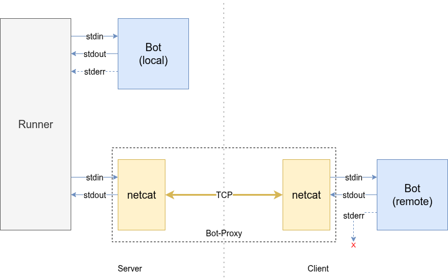
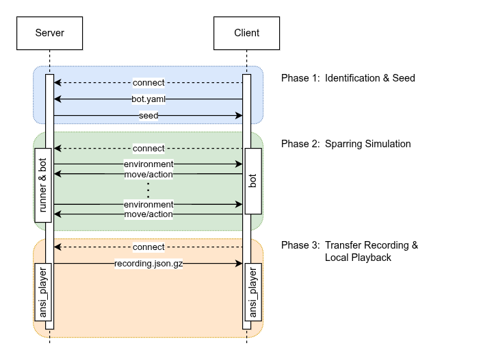
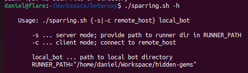
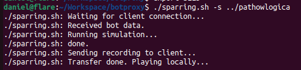
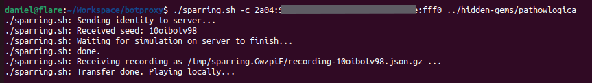
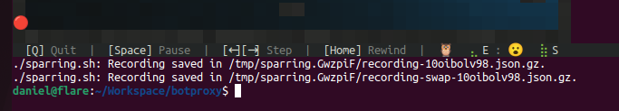

# Live-Sparring mit Bot-Proxy

Die Idee entstand durch eine Unterhaltung am [Discord-Server](https://hiddengems.gymnasiumsteglitz.de/news#inoffizieller-discord-server-fr-die-community).  Es gibt den [Feature-Request](https://github.com/specht/hidden-gems/issues/54) nach angemeldetem Sparring, wonach man einen Mitspieler herausfordern können soll, und bei dessen Annahme ein Duell über Nacht nach der regulären Auswertung oder in der Idle-Time gescheduled wird.
So eine Funktion ist natürlich aufwendig in der Implementierung; es solle aber eigentlich relativ einfach möglich sein, ein peer-to-peer Sparring umzusetzen, bei welchem die Bots jeweils auf dem eigenen Rechner ausgeführt werden.

In diesem Beitrag fangen wir mit der einfachsten Idee an und arbeiten uns im Laufe des Artikels zu einem umfangreicheren Framework vor.


## Recap: I/O Redirections

In einem vorigen [Blogbeitrag](https://hiddengems.gymnasiumsteglitz.de/blog/2026-02-17-botsteuerung-aus-dem-terminal) haben wir über Weiterleitungen der Ein- und Ausgaben gelesen.  Dadurch ist es beispielsweise möglich, die Standardausgabe an einen anderen Prozess zu schicken, und dessen Ausgabe wiederum als Standardeingabe zu lesen.  Man ist dabei nicht auf die Standardeingabe und -ausgabe beschränkt, sondern kann das im Prinzip mit (fast) allen Filedeskriptoren machen.  So funktioniert auch die Kommunikation vonseiten des Runners mit den Bots. Zusätzlich wird die Standardfehlerausgabe für Debuginformationen genutzt.


## Netcat

Wenn es nun irgendwie möglich wäre, die Ein- und Ausgaben zum und vom Runner nicht nur an einen lokalen Bot umzuleiten, sondern über das Netzwerk zu schicken, könnte man Runner und Bot auf getrennten Rechnern ausführen…  Meet **netcat**! Es gilt als Schweizer Taschenmesser für Netzwerkverbindungen, und wird am häufigsten genau dazu eingesetzt, Weiterleitungen über das Netzwerk zu realisieren.


Die Idee ist dabei folgende. Ein Spieler übernimmt die Rolle des Servers: Der Runner und der eigene Bot des Spielers werden auf dessen Rechner ausgeführt.
Mithilfe von jeweils einem netcat (`nc`) Prozess an den Enden der Verbindung wollen wir die Datenströme zwischen Runner und dem anderen Bot über das Netzwerk schicken, nämlich zum Rechner des anderen Spielers, der in der Client Rolle ist. Wir verwenden dazu TCP, ein verbindungsorientiertes Protokoll. Am Server startet `nc` im *listening* Modus, er wartet auf eingehende Verbindungen. Der Client initiiert den Verbindungsaufbau mittels *connect* zum Server.




Der Runner sieht hierbei keinen Unterschied, lediglich die Antworten lassen länger auf sich warten - wir merken uns: Die Timeouts deaktivieren!  Auch der Bot sieht keinen Unterschied, er liest weiterhin das JSON von der Standardeingabe, führt seine Berechnungen durch und schreibt move & highlight auf die Standardausgabe. Und die Debugausgaben auf der Standardfehlerausgabe? Die bleiben lokal. Entweder lesen wir mit, wenn sie auf dem Terminal ausgegeben werden, oder wir leiten sie alternativ auf `/dev/null` um.

Wie sieht das im Code aus? Für den Server müssen wir einen Bot-Proxy bereitstellen, den der Runner als Bot wahrnimmt, aber dessen Implementierung ausschließlich aus dem lauschenden netcat Prozess besteht.
Wir wählen als Kommunikationsport 4355, aber prinzipiell ist jeder beliebige Port, der nicht schon für andere Protokolle in Verwendung ist, möglich. Um auf Portnummern niedriger als 1024 zu lauschen, braucht man allerdings Admin-Rechte.
Der Bot *ist* der `nc`, siehe folgende `botproxy/start.sh`:

```bash
#!/bin/bash
exec nc -l ${PORT=4355}
```

Wir legen eine sehr einfache `botproxy/bot.yaml` an. Diese liest der Runner schon bevor er den bot startet.

```yaml
name: RemoteBot
emoji: 🌐
```

Damit wäre die serverseitige Implementierung fertig.
Den Runner rufen wir auf mit:

```bash
./runner.rb --seed=${SEED?"not set"} \
    --timeout-scale=0 --max-tps=0 --verbose=0 \
    --no-enable-debug --no-bot-chatter \
    --ansi-log-path=botproxy.json.gz \
    ${LOCAL_BOT?"not set"} botproxy
```
Den `SEED` und `LOCAL_BOT` erwarten wir uns als Umgebungsvariablen.  `LOCAL_BOT` ist der Pfad zum lokalen Bot des Spielers, `botproxy` das Verzeichnis mit unseren zwei kleinen Dateien.

Der Runner soll ohne Timeouts und sonstigen Ausgaben laufen, allerdings soll er das Duell aufzeichnen. Wird der Command ausgeführt, wartet der Runner auf den zweiten Bot, der wiederum auf eine eingehende Verbindung.


Damit sich der Client verbindet, legen wir ein neues Skript im Botverzeichnis des Client Bots an.  Wir müssen also auch hier nichts ändern, sondern bauen eine optionale Erweiterung. Wir nennen das neue Skript `botproxy_connect.sh` mit folgendem Inhalt:

```bash
#!/usr/bin/env bash

PORT=4355
HOST=${1?USAGE: $0 ipaddress}
shift

coproc NETCAT { nc $HOST $PORT ; }
exec ./start.sh "$@" <&"${NETCAT[0]}" >&"${NETCAT[1]}"
```

Aufgerufen wird das Skript mit der IP-Adresse des Servers als Argument.  Die „Magie“ passiert in den letzten zwei Zeilen:
`coproc` startet den Command `{ nc $HOST $PORT ; }` nebenläufig, und leitet dessen Standardein- und -ausgaben in Filedescriptoren, die über das Array `NETCAT` zugänglich sind, um. Das heißt, wir können Daten an `nc`, der sich mit dem Server verbindet, schicken, indem wir sie in `${NETCAT[1]}` schreiben, und können die vom `nc` gelesenen Daten von `${NETCAT[0]}` lesen.
Das passiert in der letzten Zeile, in welcher wir das Bot-Start-Skript `start.sh`, welches normalerweise der Runner ausführt, mit den entsprechenden Umleitungen aufrufen.

Der Runner legt die Aufzeichnung im Runner-Verzeichnis ab:

<div class='f ansi-player-auto-pickup mb-3' data-url='recs/botproxy-2ij7hlkb1p.json.gz' data-autoplay='false'>
    <div class='ansi-player-screen'></div>
</div>


## Interlude: Going remote mit IPv6

Was ich bisher verschwiegen habe: Getestet wurde das erstmal lokal, was auch wunderbar funktioniert hat.
Nun brauche ich aber einen Tester. Tja, dann frage ich mal den Buffo (DLH629 - 😮).

Über das Internet hatten wir „Startschwierigkeiten“. Einer von uns muss der Server sein, und aus dem Internet erreichbar sein.
Prinzipiell hat man innerhalb der EU ein [Recht auf eine öffentliche IP Adresse](https://www.rtr.at/TKP/was_wir_tun/telekommunikation/konsumentenservice/faq/FAQ_oeffentliche_IP-adresse.de.html), sofern man diese anfordert. Von meinem aktuellen ISP hatte ich noch keine public IP Adresse angefordert. Aber mein ISP weist mir eine IPv6 Adresse zu - damit sollte mein Notebook auch aus dem Internet erreichbar sein! Eine gute Gelegeneit, um IPv6 Freigaben zu testen. Ich habe in meiner Fritz-Box Config eine Freigabe für mein Notebook und den Port 4355 - nach einigem Suchen und Konfigurieren der richtigen IPv6 Adresse - eingerichtet.

Als Konsequenz davon mussten die verwendeten `nc` Befehle mit der Option `-6` ausgeführt werden.

😮 richtete seine WSL2 Installation mit mirrored-network mode ein; eine Voraussetzung für IPv6! Eine Anleitung hierfür findet ihr unter [Netzwerk im gespiegelten Modus](https://learn.microsoft.com/de-de/windows/wsl/networking#mirrored-mode-networking).


## Das Sparring-Skript

Was haben wir bis jetzt?

 * Serverseitig den Runner, und nebst dem lokalen Bot einen „botproxy“ in Form des netcat Prozesses
 * Clientseitig ein Wrapper-Skript, welches den Bot ausführt und dessen Ein-/Ausgaben via netcat an den Server schickt

Was fehlt:

 * Die richtige „Identität“ des remote Bots. Da der Runner die `bot.yaml` einliest, bevor der Bot gestartet wird, können wie diese nicht als Teil des Bots mitschicken, weshalb wir ihn der Einfachheit halber als anonymen „RemoteBot“ spielen ließen.
 * Es ist zwar schön, dass der Server aufzeichnet, aber der Spieler muss die Aufzeichnung dem remtote Spieler gesondert schicken. Klappt zu Beginn ganz gut über Discord, wird aber schnell nervig.
 * Assymmetrie des „user interface“. Die Kommandos am Server unterscheiden sich schon stark von denen, die der Client ausführen muss.

Um die Usability zu verbessern, wollen wir die Abläufe der Identitätsbekanntgabe und der Übertragung der Aufzeichnung in ein Skript mit einfachen Aufrufoptionen einbauen.

### Phasen des Ablaufs



Das Skript läuft in drei Phasen ab. Jede Phase ist eine separate Verbindung initiiert vom Clients zum Server.

 1. Der Client schickt dem Server seine `bot.yaml`. Der Server legt ein temporäres Verzeichnis an, in welches er die `bot.yaml` legt.  Außerdem schreibt der Server den Zweizeiler des `start.sh`. Das ist das Verzeichnis, das dem Runner als zweiter Bot angegeben wird.  Danach schickt der Server dem Client den Seed, der gespielt wird.  Das ist genau genommen nicht notwendig, da dieser aus der Aufzeichnung ersichtlich ist. Aber ich wollte den Seed im Filenamen der Aufzeichnung selbst haben.
 2. Das eigentliche Sparring. Das ist die Simulation durch den Runner, die oben schon beschrieben wurde.  Der Server schreibt die Aufzeichnung davon in das temporäre Verzeichnis.
 3. Der Server schickt dem Client die Aufzeichnung. Der Client schreibt diese in ein temporäres Verzeichnis.  Nach diesem Transfer startet auf beiden Seiten lokal die Wiedergabe durch den Ansi-Player.


### Socat

Der Verbindungsaufbau und vor allem der -abbau hat in den ersten Versuchen nicht immer reibungslos geklappt. Nach ein wenig Recherche und Experimentieren haben wir *netcat* durch *socat* ersetzt.
Das Verbindungshandling ist in *socat* sauberer umgesetzt. Außerdem kann *socat* Umleitungen in Files und zu Prozessen intern behandeln, ohne Umweg über die Shell. Zusätzlich bietet es eine enorme Menge an weiteren Features, wie ein kurzer Blick auf die [man page](http://www.dest-unreach.org/socat/doc/socat.html) zeigt.
Socat ist quasi der „große Bruder“ von netcat:


So vereinfacht sich beispielsweise der Aufruf im Client und macht die Nutzung von `coproc` überflüssig:

```bash
socat EXEC:"./start.sh $@" TCP6:[${HOST}]:${PORT},retry=10,interval=1
```

Der Aufruf im serverseitigen `start.sh` sieht auch nicht wesentlich komplizierter aus:

```bash
exec socat - TCP6-LISTEN:${PORT=4355},reuseaddr
```

Für einen unidirektionalen File-transfer, wie er für die Aufzeichnung verwendet wird, schreiben wir:

```bash
# on the server
socat -u OPEN:"$fname" TCP6-LISTEN:${PORT},reuseaddr

# on the client
socat -u TCP6:[${REMOTE_HOST}]:${PORT},retry=10,interval=1 OPEN:"$fname",creat,trunc
```

Die Verwendung von `-u` (unidirektionaler Modus) erlaubt *socat* auf Besonderheiten des TCP Protokolls einzugehen, was dessen Nutzung robuster macht.
Man kann auch auszuführende Befehle adressieren, so zum Beispiel das Empfangen und Schreiben der `bot.yaml` am Server sowie das anschließende Zurückschicken des Seed, in der initialen Phase:

```bash
socat TCP6-LISTEN:${PORT},reuseaddr  SYSTEM:"cat > ${RUNDIR}/bot.yaml && echo ${SEED}"
```

### Rückspiel (swap)

Im finalen Skript wird auch die „Rückrunde“ mit `--swap` simuliert.  Das und der zugehörige Transfer der Aufzeichnung geschieht *im Hintergrund* während des Playbacks der ersten Runde. Das wollen wir an dieser Stelle nicht weiter ausführen - werft am besten einen Blick in den [Source Code](https://codeberg.org/dlp/botproxy)!


### Beispielaufrufe und Ausgaben

Das Skript erwartet als Umgebungsvariable `RUNNER_PATH`. Das ist das *Verzeichnis*, in dem sich der Runner und der Ansi-Player befinden.

Als Server muss außerdem die Variable `SEED` gesetzt sein. Im Source-Repository befindet sich ein kleines Skript, das dem tagesaktuellen Seed von der Scrim-Seite lädt.

Usage-Meldung:


Die Ausgabe des Servers während der Ausführung:


Die Ausgabe des Clients während der Ausführung:


Am Ende werden die Pfade zu den Aufzeichnungen ausgegeben:



## Der Kommentar von Buffo - 😮

Die nächsten Zeilen schreibe tatsächlich ich 😮 (a.k.a. Buffo, DLH629, Michael)!

Zunächst einmal vielen Dank an Dich Daniel, dass Du diese verwegene Idee ([Feature-Request](https://github.com/specht/hidden-gems/issues/54)) nicht nur aufgenommen, sondern auch umgesetzt hast!

Dieser Hidden Gems Wettbewerb ist ja ohnehin schon genial. Es macht allerdings *noch* mehr Spaß, wenn man sich *auch* außerhalb der täglichen Scrims & ggf. Sparrings messen kann. Nicht zur Strafe, nur zur Übung! Ich persönlich habe natürlich einen *taktischen* Vorteil, denn ich möchte mich ja noch verbessern und brauche dafür "*Euch alle!*" als Sparrings-Partner 😏! Und so schaut's gerade gegen Daniel aus… 😟😕😂:

<div class='f ansi-player-auto-pickup mb-3' data-url='recs/recording-10oibolv98.json.gz' data-autoplay='false'>
    <div class='ansi-player-screen'></div>
</div>

Randbemerkung: Ich persönlich entwickle & teste meinen Bot unter Windows 11 25H2. Um dieses Framework einzusetzen verwende ich WSL2 mit Ubuntu-24.04. Das Framework kann man unter Windows auch ohne Hypervisor sowie WSL2 einsetzen, erfordert allerdings eine Umgebung wie [cygwin](https://www.cygwin.com/). Das ist allerdings sehr viel aufwändiger, da Ihr *socat* dort erst einmal in der richtigen Source-Version übersetzen müsstet. Bei Bedarf gebe ich gerne eine Anleitung dazu.

## Fazit

Sparring ist jederzeit mit dem aktuellen Bot-Entwicklungsstand peer-to-peer und ohne Herausgabe des Source-Codes oder eines Binaries möglich!

Als Nebeneffekt haben wir beide außerdem so einiges gelernt: Neue Tools wie `socat`, IPv6 Freigaben, mirrored-network mode in WSL2, …

<!-- div class="alert alert-info">
    Der Server muss über eine öffentliche IP erreichbar sein.
</div -->

## Weiterführende Links

* [Botproxy repository on codeberg.org](https://codeberg.org/dlp/botproxy)
* [socat - Multipurpose relay](http://www.dest-unreach.org/socat/)
* [WSL2: Netzwerk im gespiegelten Modus](https://learn.microsoft.com/de-de/windows/wsl/networking#mirrored-mode-networking)
